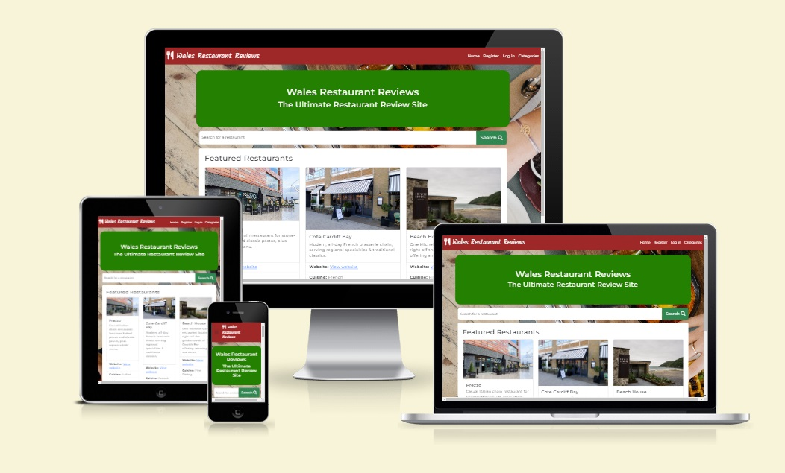

# Milestone Project 3: Restaurant Reviews Site

## Live Project

[View the live project](https://restaurant-reviews-ms3-8bb62e7f7033.herokuapp.com/)

## Table of Contents
1. [Project Goals](#project-goals)
- Business Goals
- User Goals
2. [User Experience](#user-experience)
- User Stories
- Design and Structure
- Wireframes
3. [Features](#features)
- Must Have (current features)
- Could Have
- Won't Have (for now)
4. [Technologies Used](#technologies-used)
5. [Testing](#testing)
- User stories tests
- Functionality
- HTML Validation
- CSS Validation
- JS Validation
- Python Validation
- Accessibility and Performance
- Browser Compatibility
- Device Compatibility
6. [Bugs](#bugs)
7. [Deployment](#deployment)
8. [Credits](#credits)