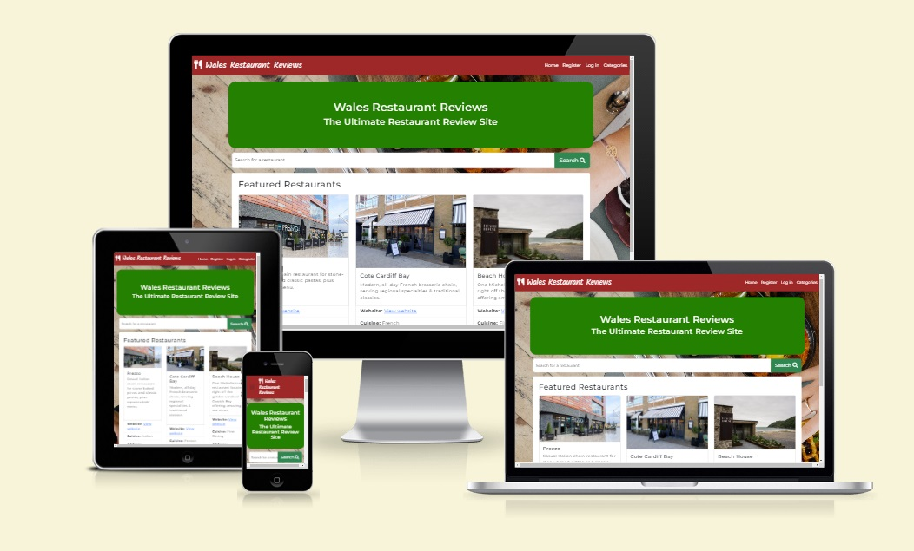

# Milestone Project 3: Restaurant Reviews Site

## Live Project

[View the live project](https://restaurant-reviews-ms3-8bb62e7f7033.herokuapp.com/)

## Table of Contents
1. [Project Goals](#project-goals)
- Business Goals
- User Goals
- Adminstrator Goals
2. [User Experience](#user-experience)
- User Stories
- Design and Structure
- Wireframes
3. [Features](#features)
- Must Have (current features)
- Could Have
- Won't Have (for now)
4. [Technologies Used](#technologies-used)
5. [Database Structure](#database-structure)
6. [Testing](#testing)
- User stories tests
- Functionality
- HTML Validation
- CSS Validation
- JS Validation
- Python Validation
- Accessibility and Performance
- Browser Compatibility
- Device Compatibility
7. [Bugs](#bugs)
8. [Deployment](#deployment)
9. [Credits](#credits)

## Project Goals

### Business Goals

As a business, I would like the website to:
- contain a comprehensive list of restaurants
- contain reviews so people can make an informed decision
- showcase various restaurants
- be able to book restaurants through the site in future

### User Goals

As a user, I would like the website to
- be easy to understand and navigate
- show me what restaurants are available
- show me reviews on restaurants so I can decide where to go to eat
- be easy to find a restaurant based on name, address or cuisine
- display easily on a number of devices

### Administrator Goals

As a website administrator I would like the website to:
- be easy to understand and navigate
- let me administer users on the site
- let me add or edit restaurants
- let me add or edit categories/cuisines

## User Experience

### User Stories

First time visitor goals:
- As a first time visitor, I would like to easily find out about restaurants.
- As a first time visitor, I would like to easily find out about reviews of restaurants.
- As a first time visitor, I would like to be able to add my review of a restaurant.

Returning visitor goals
- As a returning visitor, I would like to navigate the site and find featured restaurants.
- As a returning visitor, I would like to keep up to date with the latest reviews.
- As a returning visitor, I would like to add my reviews for restaurants I have visited.

Frequent visitor goals:
- As a frequent visitor, I would like to keep up to date with featured restaurants and any new restuarants and reviews.

### Design and Structure

The website consists of a number of pages which have a consistent structure and design. The background image was designed to convey the fact it is a restaurant site.

The main goal of the site is to show users restaurants available in Wales and real user reviews about them.

The website allows users to search for restaurants and reviews without logging in which should encourage users to regsiter an account and log in to leave their own reviews. This is why the log in and register links are consistently shown on the top navigation bar.

Once logged in, users can add their own reviews for restaurants.

#### Colour Palette

The brown and green colour represented earthy tones relating to Welsh heritage. These colours also allowed for a good contrast between text and background.

The colours I have chosen are:
- Navigation bar and footer: Brown `#A52A2A`
- Homepage title, view restaurants, add review and search buttons: Green `#008000`
- Main text: Black `#000000`
- Edit button (admin only): Blue `#0000FF`
- Delete button (admin only): Red `#FF0000`

#### Typography

I chose the following typography:
- [Kalam](https://fonts.google.com/specimen/Kalam) font for the main site title on the navigation bar
- [Montserrat](https://fonts.google.com/specimen/AR+One+Sans) for the rest of the site text

### Wireframes

Wireframes of the initial design can be found in the following wireframes:

- [Mobile wireframes](/static/images/documentation/restaurant-reviews-mobile-wireframes.pdf)
- [Desktop wireframes](/static/images/documentation/restaurant-reviews-desktop-wireframes.pdf)

## Features

### Must Have (current features)

These are the features that have already been implemented on the website.

#### Navigation

This is the main navigation on the site. It changes depending on whether a user is logged in or if the user is an administrator so that users only see the options they are authorised to see.

When a user is logged in as an administrator, they see the admin menu:

#### Home page

This has 4 elements in addition to the navigation bar:

- The main title shows what the website is about - a restaurant review site.

- When the web page is first loaded, it displays featured restaurants which are determined by an administrator selecting the featured restaurant switch when adding or editing a restaurant.

- The search bar enables users to search for a restaurant by description, name or type.

- Once a user searches for a particular term, the results are shown on the home page.

#### Registration page

This allows a user to register an account which checks if the username doesn't already exist and then the data gets written to the database. It also validates the username and password to ensure it meets the requirements and returns a message if it doesn't. The password is saved as a hash to the database. It also logs the user in and adds a user session cookie.

#### Log in page

This allows a user to log in so that they can add reviews or carry out administration tasks if they are marked as an administrator in their user account on the database. It checks the username and password is valid when compared to the database entry then sets a "user" cookie to ensure the user stays logged in.

#### Categories page

This allows a user to view restaurants based on a cuisine or type. If the user is logged in as an administrator then these categories can be added, deleted or edited.

### Add category page

This is available to logged in administrators only. It allows a category to be added to the database.

#### Add restaurant page

This is available to logged in administrators only. It allows a restaurant to be added to the database with details including the name, URL, address, image, description and type. This also allows a restaurant to be featued on the homepage.

#### Edit a restaurant

This is available to logged in administrators only. It allows a restaurant to be amended on the database. This follows the same format as the add restaurant page but completes the details that are extracted from the database. This also allows a restaurant to be featued on the homepage.

#### Edit a category

This is available to logged in administrators only. It allows a category to be amended on the database. This follows the same format as the add category page but completes the details that are extracted from the database.

#### Log out function

If a user is logged in, this feature appears on the navigation bar. Once clicked, the user is logged out and the session cookie is destroyed.

#### Restaurant listing page

This shows the details of the restaurant including any reviews that have been left by other users. It also includes a button to add a review about a restaurant. If the user is logged in as an administrator then buttons are displayed to allow the restaurant listing to be edited or deleted.

#### Add a review page

This allows a logged in user to add a review for a particular restaurant. This includes a review title and review text together with dropdowns to rate service, food and overall rating.

#### User administration page

This allows an administrator to administer users. This includes deleting users and adding and removing an administrator status on a user.

### Could Have

If there was more time available in this phase, the following features could be implemented:

- a user profile to allow a user to amend their profile including password
- a forgotten password function if a user forgets their password
- the footer could contain social media links
- a contact page for users to contact the developer in case of any issues
- display the average rating in stars of a restaurant on its listing

### Won't Have (for now)

Features that could be implemented in future iterations:

- store images in a database or external provider
- provide booking functionality for a restaurant
- allow images on user reviews
- the site could be expanded to include the whole of the UK and beyond

## Technologies Used

- [HTML5](https://en.wikipedia.org/wiki/HTML5) to create the website.
- [CSS3](https://en.wikipedia.org/wiki/CSS3) to style the website.
- [Bootstrap 4](https://getbootstrap.com/docs/4.1/getting-started/introduction/) was used for the layout of the site.
- [FontAwesome](https://fontawesome.com/) was used to create some of the icons on the site.
- [Google Fonts](https://fonts.google.com/) was used to display the typography of the site.
- [Git](https://git-scm.com/) was used for version control of the code.
- [GitHub](https://github.com/) was used as a repository for the code and GitHub pages was used to host the site.
- [Javascript](https://developer.mozilla.org/en-US/docs/Web/JavaScript) and [JQuery 3.3.1](https://jquery.com/) to create the functionality of the site
- [Python](https://www.python.org/) was used as the back-end programming language.
- [Gitpod](https://gitpod.io/) and [CodeAnywhere](https://codeanywhere.com/) were used as a cloud-based IDEs for development.
- [Flask](https://flask.palletsprojects.com/en/3.0.x/) was used as the Python framework for the site togther with the [Jinja](https://jinja.palletsprojects.com/en/3.1.x/) template.
- [MongoDB](https://www.mongodb.com/) was used as the non-relational database management with Flask.
- [Heroku](https://www.heroku.com/) was used for hosting the deployed back-end site.
- [Balsamiq](https://balsamiq.com/) was used to create the project wireframes.

## Database Structure

I used MongoDB, a non-relational database architecture.

The database is named __restaurant_review__ which has 4 collections as follows:

### restaurant_types

This contains a record of the types of restaurants/cuisines that a restaurant would be categorised as

| Key  | Type       | Comment                 |
|------|------------|-------------------------|
| _id  | ObjectId() | Automatically generated |
| type | String     |                         |

### restaurants

This contains details of the restaurants.

| Key         | Type       | Comment                                |
|-------------|------------|----------------------------------------|
| _id         | ObjectId() | Automatically generated                |
| name        | String     |                                        |
| url         | String     |                                        |
| type        | String     | Taken from restaurant_types collection |
| address     | String     |                                        |
| town        | String     |                                        |
| county      | String     |                                        |
| postcode    | String     |                                        |
| description | String     |                                        |
| image_url   | String     |                                        |
| featured    | Boolean    |                                        |

### reviews

This contains the reviews of the restaurants. It uses resturant_id to refer to the _id in the restaurants table which acts as a foreign key.

| Key            | Type       | Comment                                     |
|----------------|------------|---------------------------------------------|
| _id            | ObjectId() | Automatically generated                     |
| title          | String     |                                             |
| review_date    | String     |                                             |
| user_id        | String     |                                             |
| food_rating    | Int32      |                                             |
| service_rating | Int32      |                                             |
| overall_rating | Int32      |                                             |
| restaurant_id  | String     | _id of restaurant in restaurants collection |
| review_content | String     |                                             |

### users

Collection of users including their username, hashed password and indication if they are an administrator or not.

| Key      | Type       | Comment                 |
|----------|------------|-------------------------|
| _id      | ObjectId() | Automatically generated |
| username | String     |                         |
| password | String     | sha56 hashed password   |
| is_admin | String     | yes or no               |

## Testing

### User stories tests

The user stories have been tested and the results are:

|                                                                                           |     Outcome                                                                                                                                          |     Result    |
|-------------------------------------------------------------------------------------------|------------------------------------------------------------------------------------------------------------------------------------------------------|---------------|
|     As a   visitor, I would like to easily find out about the site is about.              |     As a   visitor, I can understand that this is a restaurant review site.                                                                          |     PASS      |
|     As a visitor,   I would like to be able to search for a restaurant.                   |     As a visitor,   I can see there is a search box on the homepage to search for a restaurant.                                                      |     PASS      |
|     As a visitor,   I would like to be able to register on the site to leave a review.    |     As a visitor,   I can select the register button on the navigation bar to register my   account.                                                 |     PASS      |
|     As a visitor,   I would like to be able to log in to my account to leave a review.    |     As a visitor,   I can select the log in button on the navigation bar to log in to my account.                                                    |     PASS      |
|     As a visitor,   I would like to review a restaurant.                                  |     As a visitor,   I can select the button on the restaurant listings to leave a review and   complete the review form.                             |     PASS      |
|     As a visitor,   I would like to view details and reviews of a restaurant.             |     As a visitor,   I can go into a restaurant listing to view the details and reviews.                                                              |     PASS      |
|     As a visitor,   I would like to view restaurants by category or cuisine.              |     As a visitor,   I can select a category from the categories page linked to from the navigation   bar to see the restaurants in that category.    |     PASS      |
|     As a user, I’d   like to be able to log out of the site once I am finished.           |     As a user, I   can select the logout button on the navigation bar to log out of my account.                                                      |     PASS      |
|     As an administrator,   I would like to be able to add a restaurant.                   |     As an administrator,   I can select the add restaurant link in the admin menu in the navigation bar   and add the restaurant details.            |     PASS      |
|     As an administrator,   I would like to edit a restaurant details.                     |     As an administrator,   I can select the button in the restaurant listing to edit the listing.                                                    |     PASS      |
|     As an administrator,   I would like to be able to delete a restaurant.                |     As an administrator,   I can select the delete button on the restaurant listing page.                                                            |     PASS      |
|     As an administrator,   I would like to be able to add a category.                     |     As an administrator,   I can add a category by selecting the add category button on the categories   page.                                       |     PASS      |
|     As an administrator,   I would like to be able to edit a category.                    |     As an administrator,   I can edit a category by selecting the edit category button on the categories   page.                                     |     PASS      |
|     As an administrator,   I would like to be able to delete a category.                  |     As an administrator,   I can delete a category by selecting the delete category button on the categories   page.                                 |     PASS      |
|     As an administrator,   I would like to be able to edit users on the site.             |     As an   administrator, I can delete a user from the site and promote or demote a user   to an administrator.                                     |     PASS      |

### Functionality

The functionality for various aspects of the site was tested and the results are:

|     Feature                       |     Expected Outcome                                                                                                                                                                                                                                                                           |     Action                                                                                                                                                                                                                                                                                                                                                                                                                                                  |     Result    |
|-----------------------------------|------------------------------------------------------------------------------------------------------------------------------------------------------------------------------------------------------------------------------------------------------------------------------------------------|-------------------------------------------------------------------------------------------------------------------------------------------------------------------------------------------------------------------------------------------------------------------------------------------------------------------------------------------------------------------------------------------------------------------------------------------------------------|---------------|
|     Navbar                        |     When   clicked it goes to the relevant page.                                                                                                                                                                                                                                               |     When   clicked it goes to the relevant page.                                                                                                                                                                                                                                                                                                                                                                                                            |     PASS      |
|     Navbar                        |     When   the navigation menu is displayed on a small screen it changes to a hamburger   menu.                                                                                                                                                                                                |     Resized   the screen to show the hamburger menu.                                                                                                                                                                                                                                                                                                                                                                                                        |     PASS      |
|     Navbar                        |     When   logged in, the navbar hides the register and log in links and displays a log   out link.                                                                                                                                                                                            |     Logged   in as a user and confirmed it shows the log out link and hides the log in and   register links.                                                                                                                                                                                                                                                                                                                                                |     PASS      |
|     Navbar                        |     When   logged in, the navbar displays the admin menu.                                                                                                                                                                                                                                      |     Logged   in as an administrator and the navbar shows the admin menu.                                                                                                                                                                                                                                                                                                                                                                                    |     PASS      |
|     Search bar                    |     When   a search term is entered and the search button is clicked, the relevant  restaurants are displayed.                                                                                                                                                                                 |     Searched   for “Italian” and clicked the search button and Italian restaurants were   displayed.                                                                                                                                                                                                                                                                                                                                                        |     PASS      |
|     Search bar                    |     When   a search term is entered and the search button is clicked, if there are no   restaurants matching the search, feedback is shown.                                                                                                                                                    |     Searched   for a term that doesn’t appear in the restaurant listings, clicked the search   button and “No results found” message displayed.                                                                                                                                                                                                                                                                                                             |     PASS      |
|     Log in form validation        |     When   a user submits their username and password in the log in page, the user gets   logged in or an error message is displayed if there is no match to the   username and password.                                                                                                      |     Tried   the log in page with both valid and invalid details. When valid details were   entered, I was logged in and a success message was displayed. When I entered   incorrect details, an error message was displayed.                                                                                                                                                                                                                                |     PASS      |
|     Register form   validation    |     When   a user submits a new username, password and password confirmation in the registration   page, the user details get added to the database and the user is logged in or   an error message is displayed if there is the username already exists or the   2 passwords do not match.    |     Attempted   to complete the registration form with an existing username and received a “username   already exists” error message.     Attempted   to complete the registration form where the passwords didn’t match and received   a “passwords don’t match” error message.     Completed   the registration form with a new username and passwords that match and it   registered and logged me in.                                                   |     PASS      |
|     Add a   restaurant            |     When   an administrator completes and submits the form, the details are added to the   database and a success message is displayed.                                                                                                                                                        |     Added   the restaurant details to the form and submitted the form. I received a   success message and I checked the database and the details had been added.                                                                                                                                                                                                                                                                                            |     PASS      |
|     Add a   category              |     When   an administrator completes and submits the form, the details are added to the   database and a success message is displayed.                                                                                                                                                        |     Added   the category details to the form and submitted the form. I received a success   message and I checked the database and the details had been added.                                                                                                                                                                                                                                                                                              |     PASS      |
|     Edit a   restaurant           |     The existing   restaurant details are displayed in the relevant form fields and when an   administrator edits and submits the form, the details are updated in the   database and a success message is displayed.                                                                          |     Edited   the restaurant details on the form and submitted the form. I received a   success message and I checked the database and the details had been updated.                                                                                                                                                                                                                                                                                         |     PASS      |
|     Edit a   category             |     The existing   category name is displayed in the relevant form field and when an administrator   edits and submits the form, the details are updated in the database and a   success message is displayed.                                                                                 |     Edited   the category details on the form and submitted the form. I received a success   message and I checked the database and the details had been updated.                                                                                                                                                                                                                                                                                           |     PASS      |
|     Page not   found page         |     When   the incorrect web page address is entered, is produces a 404 page which   guides users back to the index page.                                                                                                                                                                      |     Visited   a page that doesn't exist in the site.                                                                                                                                                                                                                                                                                                                                                                                                        |     PASS      |
|     User   administration         |     When   an administrator visits the user administration page, a list of users is displayed   together with administration status and delete buttons.                                                                                                                                        |     Visited   the user administration page as an administrator and the usernames were   displayed with the administrator status and delete buttons.                                                                                                                                                                                                                                                                                                         |     PASS      |
|     User administration           |     When   an administrator selects the delete button next to a user in the user administration   page, the user is deleted from the database and the displayed list.                                                                                                                          |     Selected   the delete button next to a user on the user administration page as an   administrator and the user was deleted from the page and the database.                                                                                                                                                                                                                                                                                              |     PASS      |
|     User administration           |     When   an administrator selects the make administrator/remove administrator button   next to a user in the user administration page, the user is either promoted   or demoted as an administration from the database and the displayed button   changes accordingly.                       |     Selected   the make administrator button next to a user on the user administration page   as an administrator and the user was made administrator on the database and   the button changed to remove administrator.     Selected   the remove administrator button next to a user on the user administration   page as an administrator and the user was removed as an administrator on the   database and the button changed to make administrator.    |     PASS      |
|     Write a   review              |     When   a user selects the write a review button on a restaurant listing, the write a   review form is displayed when they are logged in or they are redirected to   the login page if they are not logged in.                                                                              |     Selected   the write a review button whilst logged in and the write a review form was   displayed.     Selected   the write a review button whilst not logged in and the login page was displayed.                                                                                                                                                                                                                                                      |     PASS      |
|     Write a   review              |     When   a logged in user completes the review form and selects submit, the review is   added to the database together with the username and restaurant ID and the   user is redirected to the restaurant listing page with their review   displayed.                                        |     Logged   in and completed the form. I was redirected to the restaurant listing page   once completed and my review was displayed.                                                                                                                                                                                                                                                                                                                       |     PASS      |
|     Categories   page             |     When   a user selects the category on the categories page, a list of restaurants in   the category are displayed or a no restaurants found message is displayed.                                                                                                                           |     Selected   a category that contained restaurants and they were displayed.     Selected   a category that did not have any restaurants and no restaurants found message   displayed.                                                                                                                                                                                                                                                                     |     PASS      |
|     Categories   page             |     When   an administrator is logged in, edit, delete and add category buttons are   displayed on the categories page.                                                                                                                                                                        |     Logged   in as an administrator and the edit, delete and add category buttons were   displayed.                                                                                                                                                                                                                                                                                                                                                         |     PASS      |
|     Categories   page             |     When   an administrator selects the delete button next to a category, the category   is deleted from the database and is removed from the list.                                                                                                                                            |     Selected   the delete button and the category was deleted from the database and removed   from the list.                                                                                                                                                                                                                                                                                                                                                |     PASS      |
|     Categories page               |     When an administrator is logged in selects   edit category button next to a category, the edit category page is displayed.                                                                                                                                                                 |     Selected   the edit category button and the edit category page was displayed.                                                                                                                                                                                                                                                                                                                                                                           |     PASS      |
|     Categories page               |     When an administrator is logged in selects   add category button, the add category page is displayed.                                                                                                                                                                                      |     Selected   the add category button and the add category page was displayed.                                                                                                                                                                                                                                                                                                                                                                             |     PASS      |

### HTML Validation

All pages were tested using the [W3C HTML validator](https://validator.w3.org/nu/) and no errors were found. The results are in the attached [PDF document](/static/images/documentation/html-validation.pdf).

### CSS Validation

The CSS stylesheet styles.css was checked using the [W3C CSS validator](https://validator.w3.org/) and no errors were found.

.

## JS Validation

[JSHint](https://jshint.com/) was used to validate the JavaScript for script.js using the configuration to assume ES6 and jQuery. The validator identified 2 statements without semicolons which were corrected and the script.js file then passed validation.

## Python Validation

The app.py Python code was checked using the [CI Python Linter](https://pep8ci.herokuapp.com/). There were a number of lines that were too long so these were corrected. The check was rerun and was found to be PEP8 compliant with no errors.

### Accessibility and Performance

Accessibility was checked to ensure that Aria labels and image alt text was added to all images and visual elements on the site.

Lighthouse reports were also created which passed accessibility except sequential headings as h5 was used in the card section as recommended by Bootstrap. Changing this to h2 would change the look of the website but this could be looked at in future iterations. There were also a few performance suggestions which could be implemented in future iterations:

- [Lighthouse report for index page](/static/images/documentation/lighthouse-report-index.pdf)
- [Lighthouse report for add category page](/static/images/documentation/lighthouse-report-add-category.pdf)
- [Lighthouse report for add restaurant page](/static/images/documentation/lighthouse-report-add-restaurant.pdf)
- [Lighthouse report for categories page](/static/images/documentation/lighthouse-report-categories.pdf)
- [Lighthouse report for edit restaurant page](/static/images/documentation/lighthouse-report-edit-restaurant.pdf)
- [Lighthouse report for login page](/static/images/documentation/lighthouse-report-login.pdf)
- [Lighthouse report for restaurant display page](/static/images/documentation/lighthouse-report-restaurant.pdf)
- [Lighthouse report for restaurants listing page](/static/images/documentation/lighthouse-report-restaurants.pdf)
- [Lighthouse report for user administration page](/static/images/documentation/lighthouse-report-user-admin.pdf)
- [Lighthouse report for write review page](/static/images/documentation/lighthouse-report-write-review.pdf)

### Browser Compatibility

The website has been tested on the follwing browsers:

- Google Chrome 120.0.6099.225 (Official Build) (64 bit)
- Mozilla Firefox 122.0 (64-bit)
- Microsoft Edge Version 121.0.2277.83 (Official build) (64-bit)

The layout, functionality and website works on all the above browsers.

### Device Compatibility

The responsiveness and layout of the site has been tested on a number of devices including tablets, desktops and mobile phones from iPhone 5 to 5K screens and the website displays correctly.

Chrome developer tools were used at various points during the development including when changes were made to the layout.

### Check links work

All links were tested manually and by using the [Broken Link Checker](https://chrome.google.com/webstore/detail/broken-link-checker/nibppfobembgfmejpjaaeocbogeonhch?utm_source=ext_sidebar&hl=en-US) extension on Google Chrome.

## Bugs

## Deployment

## Credits

- The colour palette was generated by https://www.color-hex.com/
